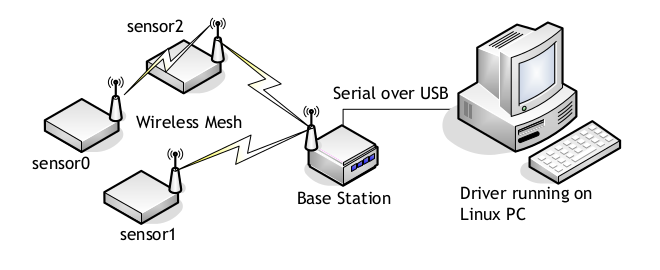
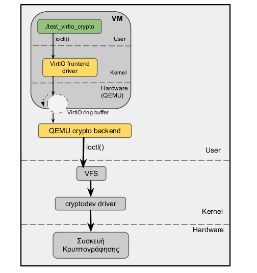

OS-lab
=====
This repo includes assignments (source code and reports) for Operating Systems Lab Ntua Course, 7th Semester. The course contains laboratory exercises on the following topics: distributed programming in UNIX, implementation of device driver, extension of Linux operating system, programming at the core level of the OS, development of virtual hardware in a virtualized execution environment.

## :busts_in_silhouette: Authors

 * Nikos Christopoulos ([christopni](https://github.com/christopni))
 * Panagiotis Giannoulis ([pangiann](https://github.com/pangiann))
# Lab1 - Riddle 


# Lab2 - Lunix Device Driver

In the second lab we are asked to implement a character device driver for a wireless sensor network under the operating system Linux. This network has a number of sensors (wireless Crossbow MPR2400CA cards with voltage, temperature and MDA100CB) and a base station (MPR2400CA wireless card) and USB MIB520CB interface). The base station connects via USB to Linux computer system on which the requested device driver will run (Lunix: TNG). The construction of a character device driver is required,  which will receive the measurement data from the sensor network in raw format, will filter them, and then will export them to the user space on different devices, depending on its type measurement and the sensor from which it comes. So there will be three devices for each sensor: e.g., for the first sensor are /dev/lunix0-batt, /dev/lunix0-temp and /dev/lunix0-light. In addition, more than one users will be able to read from the same device driver at the same time. 

The system is organized in two main parts: 

- The first undertakes the collection of data from the Lunix line discipline  [lunix-ldisc.c](lunix-tng/lunix-tng-helpcode-20201029/lunix-ldisc.c). Then, data are processed by lunix-protocol ([lunix-protocol.c](lunix-tng/lunix-tng-helpcode-20201029/lunix-protocol.c)) so as to extract the values of the measured sizes, which are kept in appropriate cache structures in memory (Lunix sensor buffers)  ([lunix-sensors.c](lunix-tng/lunix-tng-helpcode-20201029/lunix-sensors.c)) . 

- The second part receives the data from the temporary buffers and exports them to the user space in the appropriate format, implementing a set of character devices. A file called [lunix-chrdev.c](lunix-tng/lunix-tng-helpcode-20201029/lunix-chrdev.c) is created where  the below file operations are implemented in order to communicate properely with the user space.
```C
static struct file_operations lunix_chrdev_fops =
{
  	.owner          = THIS_MODULE,
	.open           = lunix_chrdev_open,
	.release        = lunix_chrdev_release,
	.read           = lunix_chrdev_read,
	.unlocked_ioctl = lunix_chrdev_ioctl,
	.mmap           = lunix_chrdev_mmap
};
```



# Lab3 - Virtio Crypto Device
The object of this exercise is the development of virtual hardware in the QEMU-KVM virtualization environment.
As part of the exercise, we are asked to  design and implement a virtual VirtIO cryptographic device, which will now be part of QEMU. The virtual encryption device will allow running processes inside the virtual machine to access real cryptography host device  using para-virtualization technique (paravirtualization).

The cryptodev-linux device allows applications to access hardware crypto accelerators by making calls to a special file /dev/crypto. More on how to access cryptodev-linux devices and the offered API can be read at cryptodev-linux programming guide  http://cryptodev-linux.org/. Our driver's usage scenario is to create a tool for encrypted communication over TCP/IP using unix sockets in which we'll be able to test (and verify) the functionality of our virtio device driver.

So, the first part of this lab is to create a chat tool with the use of the BSD Sockets API ( [socket-client.c](virtio-cryptodev/sockets/encrypted_chat/socket-client.c) and [socket-server.c](virtio-cryptodev/sockets/encrypted_chat/socket-server.c) ). Initially, the two ends will communicate through the TCP protocol and the data wil be transmitted over TCP / IP communication encrypted. 

Second part concerns the encryption of data. We will use the crypto device driver to encrypt them. By making ioctl() calls in the special file /dev/crypto the client will have the ability to encrypt its data before transferring it to the server. Similarly, the other clients will again be able to decrypt the corresponding data using the crypto device. 

The third and final part of the lab is to create a virtual  device for virtual machines running on QEMU. Specifically, we are called upon to use the technique of para-virtualization (virtio type) in order to communicate immediately with the host and use the real device /dev/crypto (and not a software simulation of it) with the ultimate goal of best performance. The below image shows the architecture of the system. 



Essentially, in this implementation the ioctl() calls used by the user of the guest machine(front-end) should be properly transferred to the hypervisor(back-end) through virtio package and in particular the virtqueues, so that the latter can call the real crypto device ([crypto-chrdev.c](virtio-cryptodev/virtio-cryptodev-code/guest/crypto-crdev.c) and [virtio-cryptodev.c](virtio-cryptodev/virtio-cryptodev-code/qemu/virtio-cryptodev.c))
